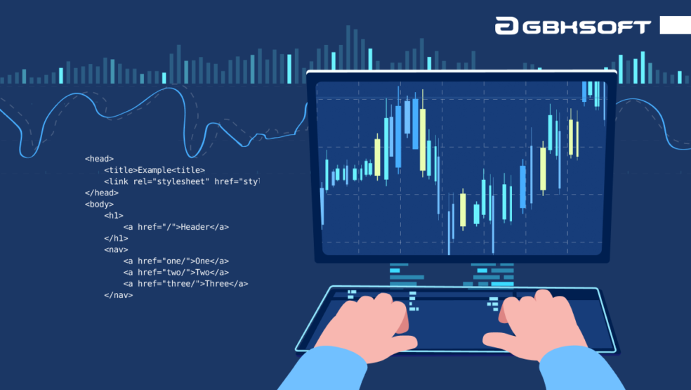

# Python-for-Financial-Analysis-and-Algorithmic-Trading

## Course Description

This course covers the following topics used by financial professionals:

* Python Fundamentals
* NumPy for High Speed Numerical Processing
* Pandas for Efficient Data Analysis
* Matplotlib for Data Visualization
* Using pandas-datareader and Quandl for data ingestion
* Pandas Time Series Analysis Techniques
* Stock Returns Analysis
* Cumulative Daily Returns
* Volatility and Securities Risk
* EWMA (Exponentially Weighted Moving Average)
* Statsmodels
* ETS (Error-Trend-Seasonality)
* ARIMA (Auto-regressive Integrated Moving Averages)
* Auto Correlation Plots and Partial Auto Correlation Plots
* Sharpe Ratio
* Portfolio Allocation Optimization 
* Efficient Frontier and Markowitz Optimization
* Types of Funds
* Order Books
* Short Selling
* Capital Asset Pricing Model
* Stock Splits and Dividends
* Efficient Market Hypothesis
* Algorithmic Trading with Quantopian
* Futures Trading